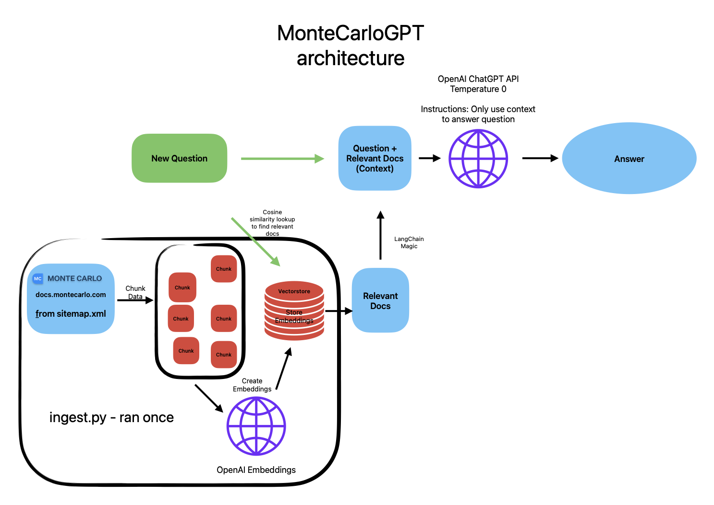

# MonteCarloGPT

**What if you could ask a question and get an answer from the Monte Carlo documentation?**

This repo is an implementation of a locally hosted chatbot specifically focused on question answering over the [Monte Carlo documentation](https://docs.getmontecarlo.com/).
Built with [OpenAI ChatGPT API](https://openai.com/blog/introducing-chatgpt-and-whisper-apis), [LangChain](https://github.com/hwchase17/langchain/) and [FastAPI](https://fastapi.tiangolo.com/).

The app leverages LangChain's streaming support and async API to update the page in real time for multiple users.

---

## ✅ Running locally (MacOS/Linux)

**Note: this app requires OpenAI's ChatGPT API. It costs money to use the API.** More information here: [OpenAI ChatGPT](https://openai.com/pricing)

1. Clone the repo:
   1. `git clone git@github.com:mvfolino68/MonteCarloGPT.git`
2. Install dependencies: **_tested on Python 3.10.9_**
   1. from within the repo, setup a virtual environment: `python3 -m venv _venv`
   2. activate the virtual environment: `source _venv/bin/activate`
   3. install dependencies: `pip install -r requirements.txt`
3. Set up an OpenAI API Key:
   1. you can use the [OpenAI API](https://openai.com/product#made-for-developers) documentation to set up an API key.
   2. set the environment variables for your API key. See [Environment Variables](#environment-variables) for more information.
4. Setup a vectorstore:
   1. option 1: Use the existing vectorstore:
      1. download the vectorstore from here and place it in the root directory of the repo. [download here](https://drive.google.com/uc?export=download&id=1HPa7FX282_1Lzbkhupoh8BibtN2xXEZ5)
   2. option 2: Create a new vectorstore:
      1. Note: this method will take a while to run due to the size of the Monte Carlo docs.
      2. run `python ingest.py` to ingest Monte Carlo docs data into the vectorstore (only needs to be done once).
      3. you can use other [Document Loaders](https://langchain.readthedocs.io/en/latest/modules/document_loaders.html) to load your own data into the vectorstore.
5. Run the app: `make start`
6. Open [localhost:9000](http://localhost:9000) in your browser.
7. Ask a question! 🎉

## Environment Variables

You can set these environment variables in a `.env` file in the root directory of the project. See the `.env.example` file for an example.

### If Using OpenAI API Directly Set these Variables

| Variable | Description | Link |
| --- | --- | --- |
| `OPENAI_API_KEY` | Your OpenAI API key. | [OpenAI Authentication](https://beta.openai.com/docs/api-reference/authentication) |
| `OPENAI_API_TYPE` | `"open_ai"` if using OpenAI API. | - |
| `OPENAI_API_BASE` | Leave this blank if using OpenAI API directly. | - |
| `AZURE_OPENAI_DEPLOYMENT_NAME` | Leave this blank if using OpenAI API directly. | - |
| `AZURE_OPENAI_MODEL` | Leave this blank if using OpenAI API directly. | - |
| `OPENAI_API_VERSION` | Leave this blank if using OpenAI API directly. | - |

### If Using Azure OpenAI Set these Variables

| Variable | Description | Link |
| --- | --- | --- |
| `OPENAI_API_KEY` | Your Azure OpenAI API key. | [Azure OpenAI Quickstart](https://learn.microsoft.com/en-us/azure/cognitive-services/openai/chatgpt-quickstart?tabs=command-line&pivots=programming-language-python#retrieve-key-and-endpoint) |
| `OPENAI_API_TYPE` | Set this to `"azure"` if using Azure OpenAI. | - |
| `OPENAI_API_BASE` | The base URL for your Azure OpenAI resource. | [Azure OpenAI Quickstart](https://learn.microsoft.com/en-us/azure/cognitive-services/openai/chatgpt-quickstart?tabs=command-line&pivots=programming-language-python) |
| `AZURE_OPENAI_DEPLOYMENT_NAME` | The name of your Azure OpenAI deployment. | - |
| `AZURE_OPENAI_MODEL` | The name of the model you are using. | [Azure OpenAI Quickstart](https://learn.microsoft.com/en-us/azure/cognitive-services/openai/chatgpt-quickstart?tabs=command-line&pivots=programming-language-python) |
| `OPENAI_API_VERSION` | The OpenAI API version and should align with the model you are using. | [Azure OpenAI Quickstart](https://learn.microsoft.com/en-us/azure/cognitive-services/openai/concepts/models#model-summary-table-and-region-availability) |

### If Using Pinecone As Vectorstore Set these Variables

| Variable | Description | Link |
| --- | --- | --- |
| `PINECONE_API_KEY` | Your Pinecone API key. | [Pinecone Quickstart](https://docs.pinecone.io/docs/quickstart) |
| `PINECONE_ENVIRONMENT` | The name of your Pinecone environment. | [Pinecone Quickstart](https://docs.pinecone.io/docs/quickstart) |
| `PINECONE_INDEX` | The name of the Pinecone index. | [Pinecone Quickstart](https://docs.pinecone.io/docs/quickstart) |

## 🐳 Running locally (Docker)

This method requires that you have Docker installed on your machine. To install Docker, follow the instructions [here](https://docs.docker.com/get-docker/). This setup assumes that you set up your environment variables in a `.env` file in the root directory of the project.

```shell
docker build -t montecarlogpt .
docker run --env-file .env -p 9000:9000 montecarlogpt
```

## 📸 Screenshots


---

## 🤔 How it works

### 📝 Ingestion (run once to create the vectorstore)

1. Pull html from the [Monte Carlo documentation](https://docs.getmontecarlo.com/) using `sitemap.xml` and BeautifulSoup to clean the html.
2. Load the data into DocumentStore using LangChain's [UstructuredHTML Loader](https://langchain.readthedocs.io/en/latest/modules/document_loaders/examples/html.html).
3. Chunk the documents into smaller chunks using LangChain's [TextSplitter](https://langchain.readthedocs.io/en/latest/reference/modules/text_splitter.html).
4. Create embeddings for each chunk using OpenAI's [OpenAI Embeddings](https://platform.openai.com/docs/guides/embeddings).
5. Load the embeddings into a vectorstore using LangChain's [vectorstore wrapper](https://langchain.readthedocs.io/en/latest/reference/modules/vectorstore.html).
   1. FAISS is used as the vectorstore in this example. More information on FAISS can be found [here](https://ai.facebook.com/tools/faiss/).

### 📝 Question-Answering

1. User accesses text input box and chat history via the web app.
2. The web app sends the chat history and user input to the backend. The backend uses LangChain's [ConversationalRetrievalChain](https://langchain.readthedocs.io/en/latest/modules/indexes/chain_examples/chat_vector_db.html) to:
   1. Determine what a standalone question would be (using ChatGPT).
   2. Look up relevant documents from the vectorstore.
   3. Pass the standalone question and relevant documents to ChatGPT to generate a final answer.
3. Return the final answer to the web app and add the answer to the chat history.

Diagram:


## Troubleshooting

1. If you receive an error like this:

   ```shell
   WARNING:/Users/<user>/Documents/MonteCarloGPT/.venv/lib/python3.10/site-packages/langchain/chat_models/openai.py:Retrying langchain.chat_models.openai.acompletion_with_retry.<locals>._completion_with_retry in 4.0 seconds as it raised APIConnectionError: Error communicating with OpenAI.

   ```

   [Check here to see the fix](https://github.com/hwchase17/chat-langchain/issues/14)

2. If you receive this error when using the download vectorstore:

   ```shell

   ERROR:root:IndexFlat.search() missing 3 required positional arguments: 'k', 'distances', and 'labels'

   ```

   Rerun the `ingest.py` script to create a new vectorstore.

## 🚀 Helpful Links

Blog Posts:

- [Initial Launch](https://blog.langchain.dev/langchain-chat/)
- [OpenAI ChatGPT](https://blog.langchain.dev/openai-chatgpt/)
- [Video Explaination](https://www.youtube.com/watch?v=prbloUGlvLE)

## Contributing to MonteCarloGPT

I'm happy to accept contributions to this project. Please open an issue or a pull request.

## Future Work

- Make the app available online (currently only available locally). This will require a hosting service that can support the vectorstore and the web app.
- Allow users to input their own OpenAI API key in the frontend.
- Include more documentation sites.
- Tune the ChatVectorDBChain to improve the quality of the answers.
- Produce the chat history as a topic.

## Follow me on Twitter & LinkedIn

Twitter: [@mvfolino68](https://twitter.com/mvfolino68)
LinkedIn: [mfolino](https://www.linkedin.com/in/mfolino/)
